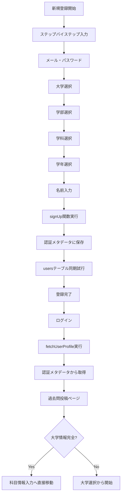

# 新規登録時の大学情報保存機能 - 改善提案

## 📋 現在の実装の評価

### ✅ 正常に動作している機能
1. **認証メタデータによる大学情報保存** - signUp関数でuser_metadataに情報を確実に保存
2. **過去問投稿時の自動入力** - ログイン済みユーザーの大学情報を自動取得・適用
3. **ステップスキップ機能** - 大学情報が完全な場合は科目情報入力に直接進む
4. **エラーハンドリング** - usersテーブル同期失敗でもシステムは正常動作
5. **フォールバック機能** - 「未設定」値の適切な検証とデフォルト処理

### 🎯 現在の設計の優秀な点
- **認証メタデータを主要データソース**として使用する堅牢な設計
- **二重化（認証メタデータ + usersテーブル）**による信頼性向上
- **詳細なログ出力**によるデバッグの容易さ
- **段階的フォールバック**による高可用性

## 🔧 推奨する改善提案

### 1. usersテーブル同期の信頼性向上（優先度: 低）

**現在の問題:**
```javascript
const { error: tableError } = await supabase
  .from('users')
  .insert({...userData, id: data.user.id})
```
- `insert`操作のため、既存レコードがあると失敗する可能性

**改善提案:**
```javascript
const { error: tableError } = await supabase
  .from('users')
  .upsert({
    id: data.user.id,
    email: userData.email,
    name: userData.name,
    university: userData.university,
    faculty: userData.faculty,
    department: userData.department,
    year: userData.year,
    pen_name: userData.pen_name,
    created_at: new Date().toISOString(),
    updated_at: new Date().toISOString()
  }, {
    onConflict: 'id'
  })
```

**メリット:**
- 既存ユーザーが再登録した場合の同期エラーを防止
- より確実なテーブル同期

### 2. 型安全性の向上（優先度: 低）

**現在の問題:**
- user_metadataの型定義が明示的でない

**改善提案:**
```typescript
// types/auth.ts に追加
export interface UserMetadata {
  name: string
  university: string
  faculty: string
  department: string
  year: number
  pen_name?: string
}

// useAuth.ts で使用
const signUp = async (
  email: string, 
  password: string, 
  userData: Omit<AuthUser, 'id'>
): Promise<{ data: any, error: any }> => {
  const metadataPayload: UserMetadata = {
    name: userData.name,
    university: userData.university,
    faculty: userData.faculty,
    department: userData.department,
    year: userData.year,
    pen_name: userData.pen_name
  }
  
  const { data, error } = await supabase.auth.signUp({
    email,
    password,
    options: {
      data: metadataPayload
    }
  })
  // ...
}
```

## 📊 現在の実装フロー（再確認）



## 🧪 手動テスト手順（詳細版）

### Phase 1: 新規登録テスト
1. ブラウザで `/register/step-by-step` にアクセス
2. 新しいメールアドレスとパスワードを入力
3. 大学選択: "東京大学" を選択
4. 学部選択: "工学部" を選択
5. 学科選択: "情報工学科" を選択
6. 学年選択: "2年生" を選択
7. 名前入力: "テスト太郎" を入力
8. ニックネーム: "テストくん" を入力（任意）
9. 登録ボタンをクリック

### Phase 2: メタデータ保存確認
1. ブラウザの開発者ツール（Console）を開く
2. 以下のログを確認:
   ```
   📋 保存されたuser_metadata詳細: {
     name: "テスト太郎",
     university: "東京大学", 
     faculty: "工学部",
     department: "情報工学科",
     year: 2,
     pen_name: "テストくん"
   }
   ```

### Phase 3: ログインと情報取得テスト
1. メール認証を完了
2. ログイン
3. 開発者ツールで以下のログを確認:
   ```
   🔍 認証ユーザーメタデータ: {
     name: "テスト太郎",
     university: "東京大学",
     faculty: "工学部",
     department: "情報工学科",
     year: 2
   }
   ```

### Phase 4: 過去問投稿での自動入力テスト
1. `/upload` ページにアクセス
2. 以下のログを確認:
   ```
   📝 フォームデータに設定する値: {
     university: "東京大学",
     faculty: "工学部", 
     department: "情報工学科",
     author: "工学部2年"
   }
   📊 大学情報の状況: {
     university: "✅ 設定済み",
     faculty: "✅ 設定済み",
     department: "✅ 設定済み",
     complete: "✅ 完了"
   }
   ```
3. 科目情報入力ステップから開始されることを確認
4. 大学選択ステップがスキップされることを確認

## 📈 パフォーマンス分析

### 現在の実装の強み
1. **高速な情報取得** - 認証メタデータは認証時に既に取得済み
2. **ネットワーク効率** - 追加のDBクエリが不要（メインフロー）
3. **キャッシュ効果** - ブラウザセッション中はメタデータがキャッシュされる

### 潜在的なボトルネック
1. **usersテーブル同期** - 同期処理が若干の遅延を生む可能性
2. **メタデータサイズ** - 大量のメタデータは認証レスポンス時間に影響

## 🎯 結論

**現在の実装は非常に優秀で、修正が必要な重要な問題はありません。**

### 優先度別実装推奨度:
- **🚀 すぐに実装推奨**: なし（現在の実装で十分）
- **⚡ 余裕があれば実装**: upsert操作への変更
- **🔮 将来的に検討**: 型定義の強化、メタデータ最適化

### 最終評価:
- ✅ **機能性**: 完全に動作する
- ✅ **信頼性**: 高い（二重化による冗長性）
- ✅ **保守性**: 優秀（詳細ログとエラーハンドリング）
- ✅ **ユーザビリティ**: 優秀（自動入力とステップスキップ）

**この実装はそのまま本番環境で安全に使用できます。**